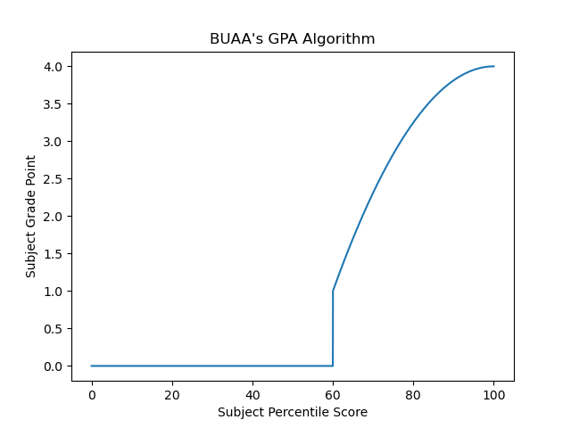
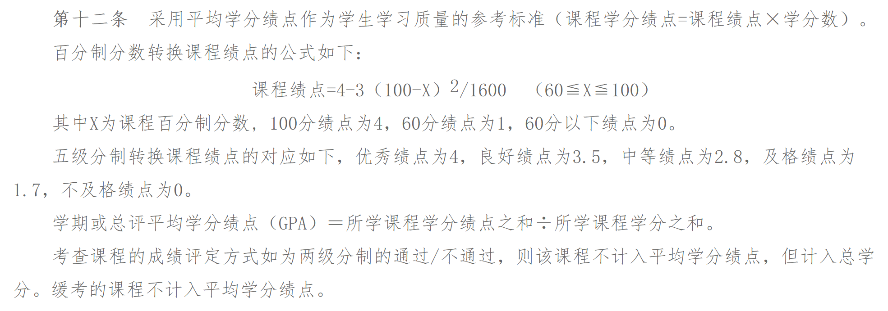
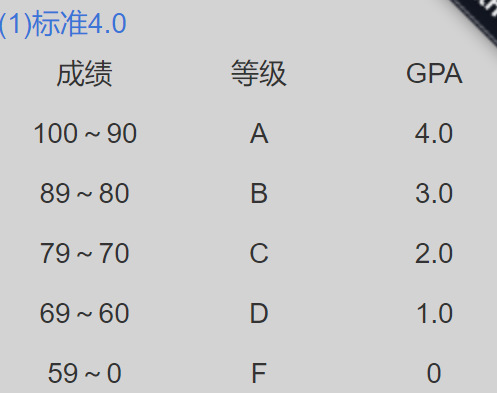
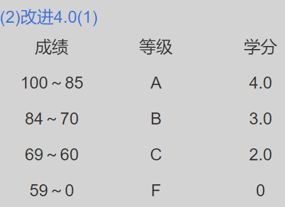
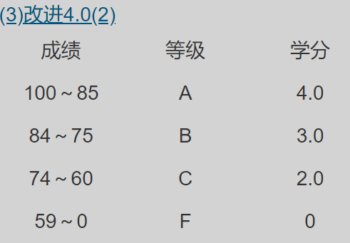
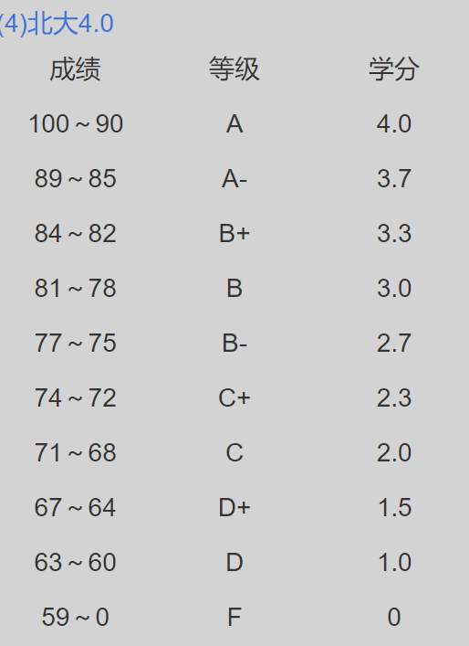
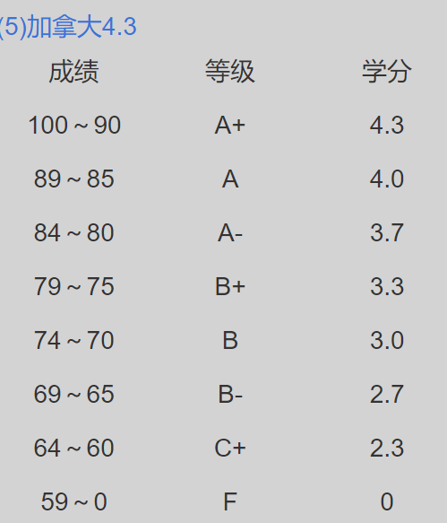
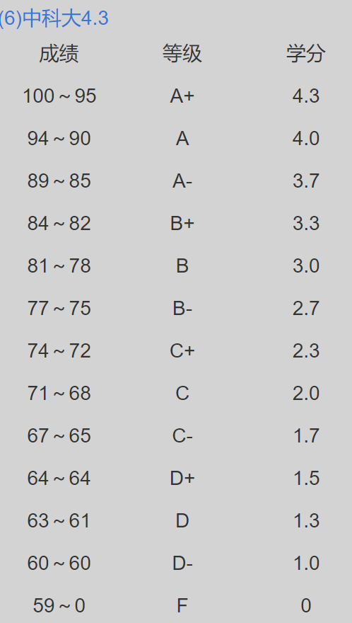
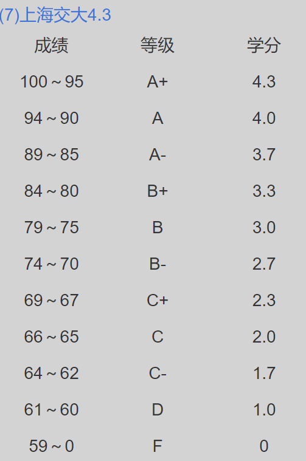

# GPA

## 1. 目标GPA

$$
加权平均分 = \frac {\Sigma 学分 \times 成绩} {\Sigma 学分}
$$

$$
GPA = \begin{cases} 4 - \frac {3 \times ( 100 - 成绩 ) ^ 2} {1600}, 成绩 \geq 60 \\ 0, 成绩 < 60 \end{cases}
$$

## 2. Ref

- [北京航空航天大学本科生学籍管理细则.pdf](_v_attachments/20200721002508695_29742/北京航空航天大学本科生学籍管理细则.pdf)
- [北京航空航天大学本科生学籍管理细则](https://jiaowu.buaa.edu.cn/bhjwc2.0/index/newsView.do?xwid=1477)
