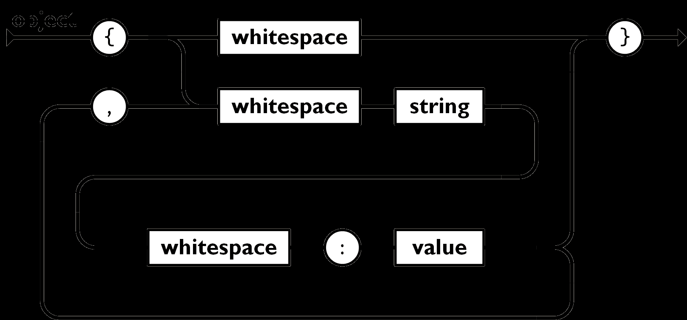
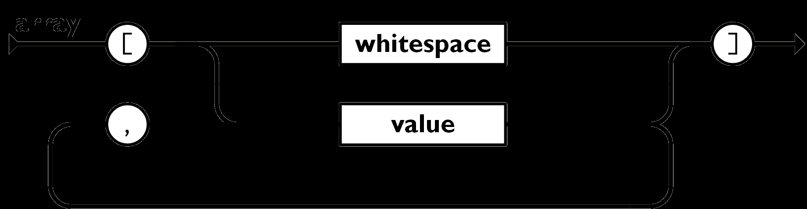
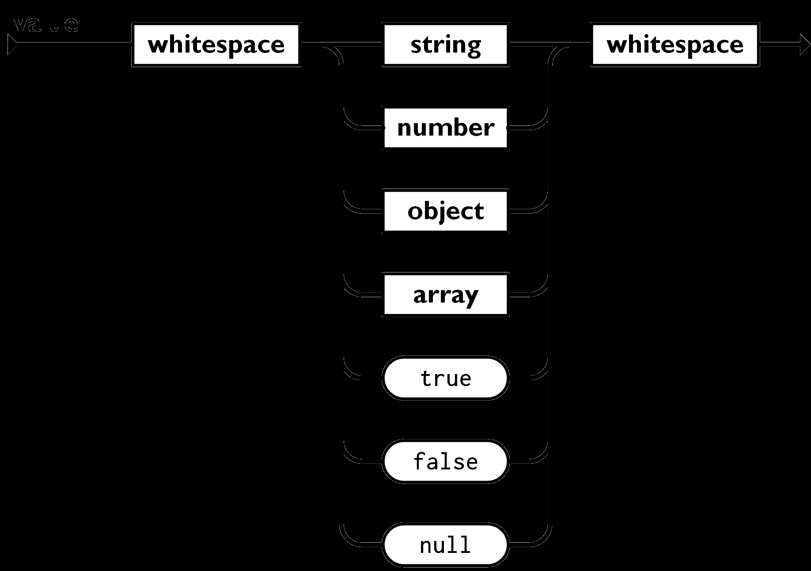
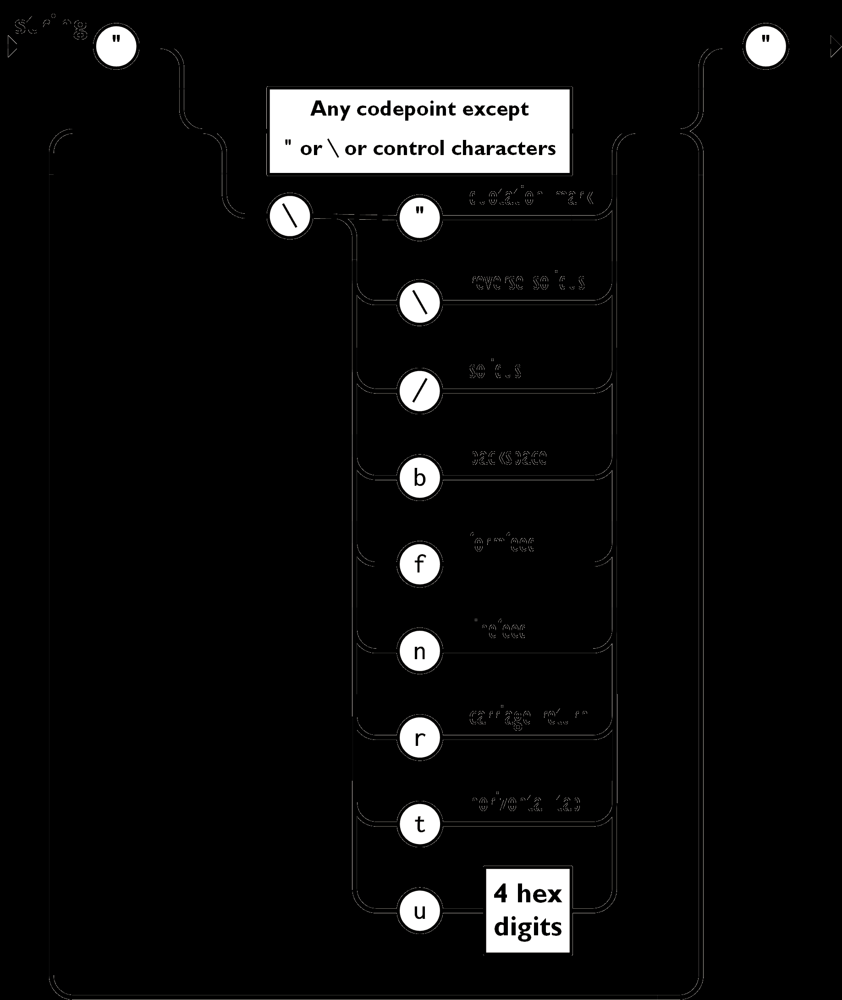
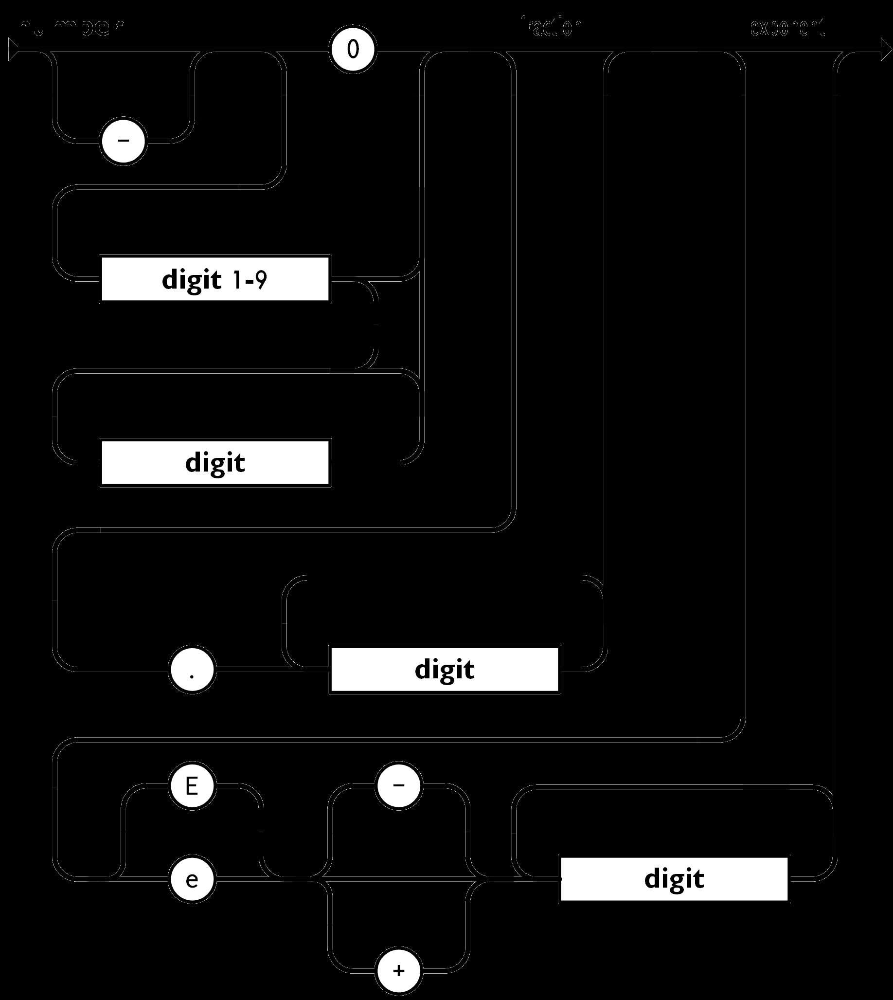

# JSON

- JavaScript Object Notation: Data Interchange Format
- Subset of JavaScript
- Support three types of value
    - Object, Mapping, Hashes, Dictionary: Set of key-value pairs
    - Array, Sequence, List: Ordered list of values
    - Scalars: Single not-dividable value

## 1. Object

- Object, Mapping, Hashes, Dictionary: Set of key-value pairs
- Set of key-value pairs in braces
- Key and value are separated by colon
- Key-value pairs are separated by comma

```json
{KEY: VALUE(, KEY: VALUE)*}
```



## 2. Array

- Array, Sequence, List: Ordered list of values
- Ordered list in brackets
- Values are separated by comma

```json
[VALUE(, VALUE)+]
```



## 3. Scalars

- Scalars: Single not-dividable value
- String: Text in double quotes: `"CONTENT"`
    - Use backslash escape
- Number: `-?INTEGER(.INTEGER)?[eE][-+]?INTEGER`
- Boolean: `true|false`
- Null: `null`







## 4. White Space

- Can be inserted between any pair of tokens


