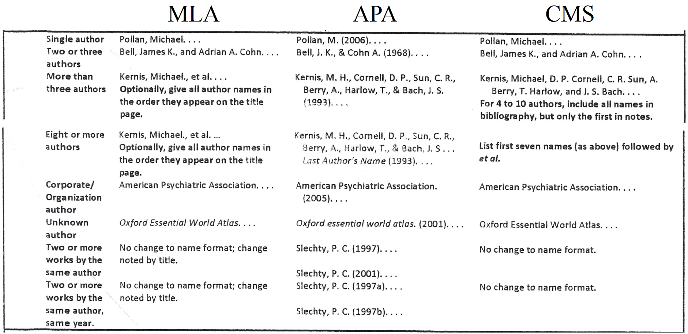
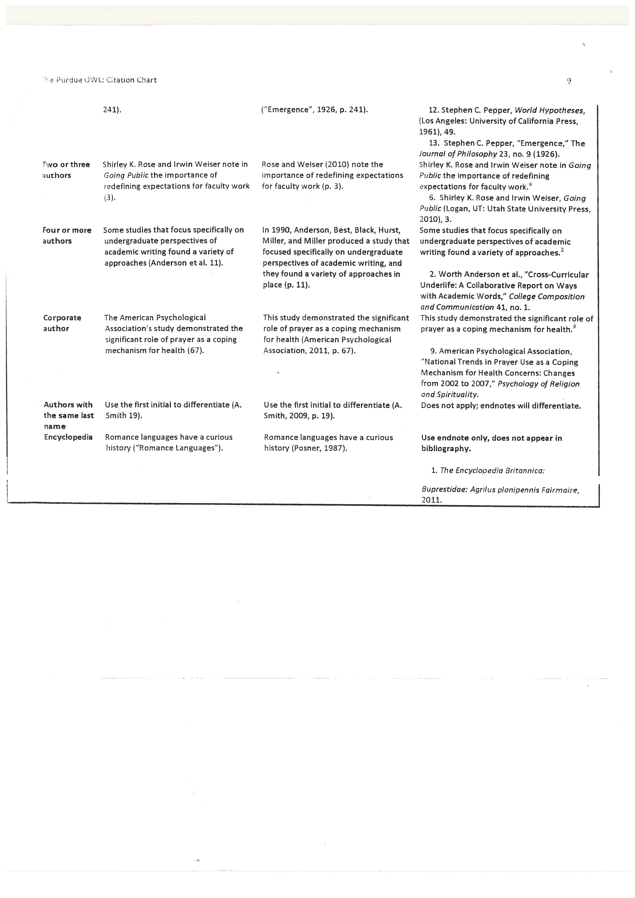

# Reference Format

[TOC]

## 1. Choice

- APA (American Psychological Association): Social Science
- MLA (Modern Language Association)
- CMS (Chicago Manual Style): Business, History, Economics

## 2. APA

### 2.1. Paper

```
[<Number>]: <Last Name>, <First Name First Character>. <Middle Name First Character>. (<Publish Year>). <Paper Title>. <Periodical Title>, <Volume Number>(<Issue Number>), <Start Page>-<End Page>.
```

#### 2.1.1. Unreleased

```
[<Number>]: <Last Name>, <First Name First Character>. <Middle Name First Character>. (<Publish Year>). <Paper Title>. Unreleased.
```

### 2.2. Book

```
[<Number>]: <Last Name>, <First Name First Character>. <Middle Name First Character>. (<Publition Year>). <Book Title>. <Publition City>: <Publisher>.
```

### 2.3. Online Resource

```
[<Number>]: <Author Name>. (<Year>(n.d. if not dated)). <Article or Page Title>. [<Larger Publication Title>, <Volume Number>(<Issue Number>). ]Retrieved from <URL>
```

#### 2.3.1. Youtube Video

```
[<Number>]: <Author Name>. (<Year>). <Videl Title> [YouTube]. [<Larger Publication Title>. ]Retrieved from <URL>
```

## 3. Reference




