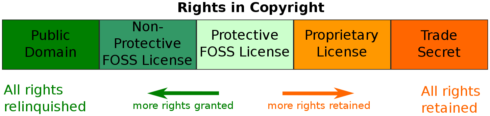
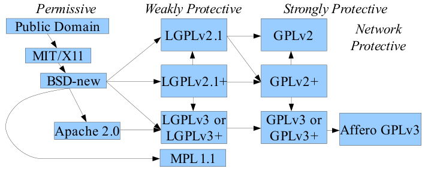

# Software License

[TOC]

## 1. Usage

- Copy License file to Project root directory
- Change License file name to `LICENSE.md` or `LICENSE`
- Add Claimer to `README.md`: Licensed under `LICENSE(.md)?`

## 2. Definition

- Proprietary (Copyright) Software
    - Focus: Intelletual Property Right of Source Code
    - Publisher retains Intellectual Property rights of source code
    - Often publish in Binary Code form. Source Code often not published
    - Copyright: Publisher retains rights of decide whether and how to make copy
    - Instance: Microsoft Windows
- Free(dom) Software
    - Focus:
        - Freedom to Cooperate and Control
        - Which lead to: Freedom to Run, Study, Change, Redistribute Software
        - Which lead to: Freedom to Use, Modify, Share Source Code
    - Instance: Free Software Foundation, GNU Project
- Open Source Software
    - Focus: Freedom to Use, Modify, Share Source Code
        - Even for commercial purpose
    - Instance: Open Source Initiative
- Permissive (Copycenter) Software
    - Free Software with no warranty and minimal redistributing requirement
    - Copycenter: Minimal redistributing requirement
    - Instance: MIT License
- Copyleft Software
    - Free Software with no warranty and same licence redistributing requirement
    - Instance: GNU's General Purpose License, GPL
- Notice
    - Inform Recipient of:
        - Software used
        - Entire copy of license
        - Author and Contributor

## 3. License

- Unlicense
    - Anything
- MIT
    - Anything with notice and no warranty
- GNU's General Purpose License version 3+
    - Anything with notice, no warranty and same licence redistributing
- Affero General Purpose License version 3
    - Anything with notice, no warranty and same licence, with source code usage and redistributing
- No License
    - All right reserved
