# UML

[TOC]

## 1. Model
- Function Model
    - Show the fuction of the system to user
    - Diagram: Usage Diagram
- Object Model
    - Show the structure of the system with concepts of object, attribute, operation, connection
    - Diagram: Class Diagram, Object Diagram, Structure Diagram
- Dynamic Model
    - Show the internal behavior of the system
    - Diagram: Sequence Diagram, Activity Diagram, Status Diagram
- Diagram:
```plain
@startuml
<Content>
@enduml
```

## 2. Graph Shape

- Line
    - Solid: `--`
    - Dotted: `..`
- Diamond
    - Hollow: `o`
    - Solid: `*`
- Arrow
    - Solic: `>`
    - Hollow: `|>`

## 3. Sequence Diagram

- Describe the coorperation between multiple objects by listing the messages between them in time order
- `<Object> -> <Object>: <Message>`: Message
- `<Object> --> <Object>: <Message>`: Asynchronous Message
- `note (left|right): <Content>`: Note last Message

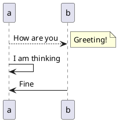

## 4. Usage Diagram

- Describe the interaction between user and the system
- Actor: `actor <Actor>`
    - 执行者
- Rectangle
```plain
rectangle <Name>
{
    <Content>
}
```
- Action:
    - `<Actor> -> (<Action>)`
    - `<Actor> --> (<Action>)`

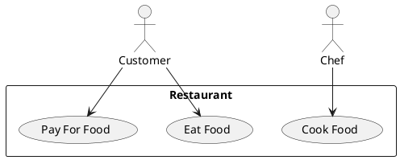

## 5. Activity Diagram

- Describe the logic process of the system
- Node
    - `(*)`: Start / End Node
    - `"<Content>"`: Normal Node
    - Branch Node:
```plain
if "<Content>"
    <Content>
else
    <Content>
endif
```
- Flow
    - Normal Flow:
        - `<Node> -> <Node>: <Label>`
        - `<Node> --> <Node>`
    - Labeled Flow:
        - `<Node> ->[<Label>] <Node>: <Label>`
        - `<Node> -->[<Label>] <Node>: <Label>`
    - Flow with direction
        - `<Node> -<Direction>> <Node>: <Label>`
        - `<Node> -<Direction>-> <Node>: <Label>`
        - Direction
            - `right`
            - `left`
            - `up`
            - `down`
    - `-> <Node>: <Label>`, `--> <Node>: <Label>`: Equivalent to `<LastNode> -> <Node>: <Label>`

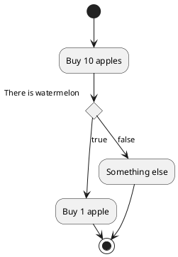

## 6. Component Diagram

- Describe the internal structure between the components of the system
    - Heavily depends on hardware
- Node
    - Dot: `<Content>`
    - Label: `[<Content>]`
- Relate to: `<Node> - <Node>: <Label>`
- Database:
```plain
database "<Label>" {
    [<Node>]
    ...
}
```

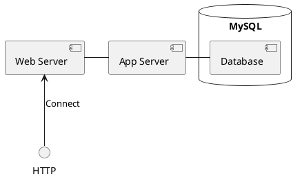

## 7. Status Diagram

- Describe the changes between the statuses of a object
- Node
    - Dot: `[*]`
    - Status: `<Status>`
- Change
    - `<Node> -> <Node>: <Label>`
    - `<Node> -<Direction>-> <Node>: <Label>`

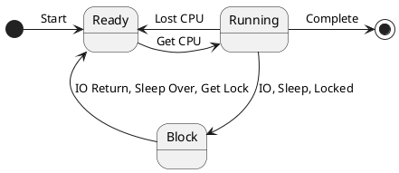

## 8. Class Diagram

- Describe Classes and the Relationship between them
- Access Modifier
    - Private: `-`
    - Protected: `#`
    - Package (Friendly): `~`
    - Public: `+`
- Class:
```plain
class <Class> {
    <Feature>
}
```
    - Class Modifier
        - Abstract: `abstract`
- Interface:
```plain
interface List {
    <Feature>
}
```
- Feature
    - Field: `<Field>`
    - Method: `<Method>(<ArgumentList>)`
- Relationship
    - Generalization: `<SubClass> --|> <SuperClass>`
    - Realization: `<Class> ..|> <Interface>`
    - Dependency
        - Weak, Occasional Usage
        - Code: Argument
            - Usee Class used as an argument in a method of User Class
        - `<UserClass> ..> <UseeClass>`
    - Association
        - Strong Usage
        - Code: Field
            - Usee Class used as a field in User Class
        - `<UserClass> --> <UseeClass>`
        - `<UserClass> -- <UseeClass>: <Label>`
        - `<UserClass> "<Quantifier>" -- "<Quantifier>" <UseeClass>: <Label>`
    - Aggregation
        - Separatable Association between System and Component
            - System has-a Component
            - Each of them has its own life cycle
        - `<System> o-- <Component>: <Label>`
    - Composition
        - Unseparatable Association between System and Component
            - System contains-a Component
            - Have same life cycle
            - Stronger than Aggregation
        - `<System> *-- <Component>`

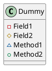

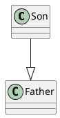

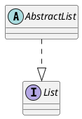

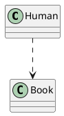

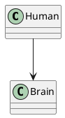

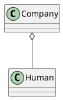

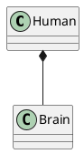
